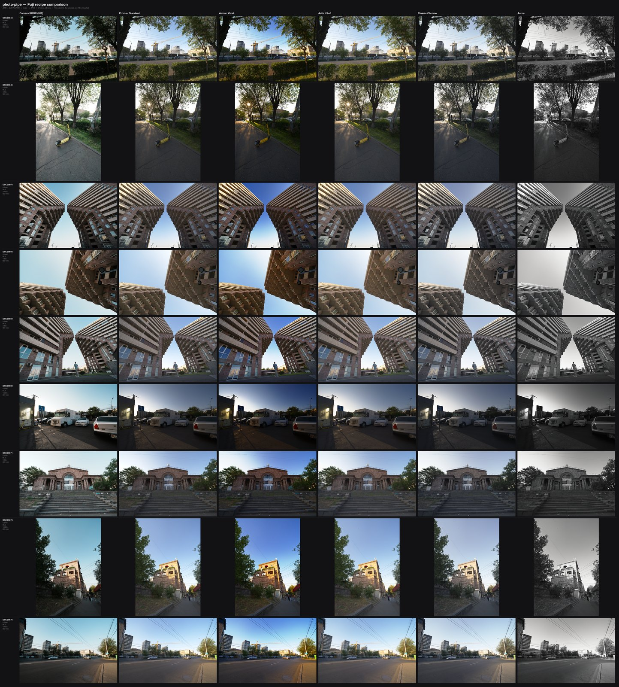
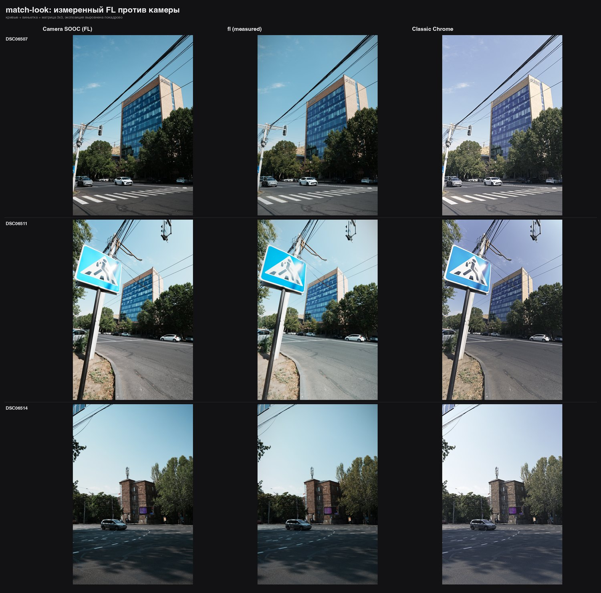

# photo-pipe

End-to-end raw pipeline: **`.ARW` → DxO PureRAW → recipe → JPEG**, plus a
comparison contact sheet.

Nothing here consumes pre-made DxO files. The pipeline drives PureRAW itself,
so a run starts from the camera raw and ends at a finished JPEG in one command.

## Install

```bash
pip install -e '.[fit]'        # 'fit' adds SciPy, needed only by fit-camera
```

Also needs [DxO PureRAW 6](https://www.dxo.com/dxo-pureraw/) and `exiftool`
(`brew install exiftool`). On macOS, HEIF decoding uses the built-in `sips`.

## Use

```bash
photo-pipe recipes                                  # list looks
photo-pipe run ~/Images/2026-08-14 --collage        # the whole shoot, all 5 looks
photo-pipe run ~/Images/2026-08-14 --recipes velvia,acros --preview
photo-pipe run photo.ARW --denoise none             # A/B: skip DxO entirely
photo-pipe fit-camera ~/Images/2026-07-30           # camera settings for a look
photo-pipe match-look ~/Images/2026-08-15 --name fl # camera's look -> a recipe
photo-pipe cache --max-gb 5                         # trim the PureRAW cache
```

The two directions are worth keeping straight: **`match-look`** copies the
camera's rendering *into* a recipe, **`fit-camera`** works out which camera
sliders approximate a recipe you already have.

As a library:

```python
from photopipe import develop, recipe

base = develop.develop("DSC0001.dng")            # scene-linear float RGB
look = recipe.load_named(["classic-chrome"])[0]
out  = recipe.apply_recipe(base, look)           # display-referred [0,1]
develop.save_jpeg(out, "out.jpg", exif_from="DSC0001.ARW")
```

Your originals are only ever read. Raws are hardlinked into a cache outside
your photo library (`~/.cache/photo-pipe`, override with `PHOTOPIPE_WORK` or
`--work`), PureRAW writes there, and exports land in `--out` (default `./out`).

### The cache will eat disk if you let it

PureRAW's DNGs are ~85 MB each, so one 80-frame shoot is close to 7 GB. After
every run the cache is trimmed back to **10 GB**, oldest first — re-running a
look on a recent shoot is the common case, and anything evicted just costs one
more PureRAW pass. Tune with `--cache-gb`, `PHOTOPIPE_CACHE_GB`, or `0` to
disable. Inspect and trim by hand with:

```bash
photo-pipe cache                 # size, count, age range
photo-pipe cache --max-gb 5      # evict oldest until under 5 GB
photo-pipe cache --clear
```

Staged raws are hardlinks to your originals, so they cost no extra space —
only the DNGs count.

---

## Driving DxO PureRAW headlessly

PureRAW ships no documented CLI, but its Lightroom plugin drives the app over
one, and that interface works standalone. The plugin (recovered from
`DxO PureRAW 6.app/Contents/Resources/LightroomPluginData/`) writes a
newline-separated list of source files and runs:

```bash
open -n -b com.dxo-labs.PureRAWv6.standalone --args \
    --as-lightroom-last-settings-plugin \
    --lr-version="14.0" \
    --batch-file="/path/to/list.txt"
```

PureRAW processes the whole batch unattended and writes
`<stem>-DxO_<method>.dng` **next to each source file** — which is exactly why
the pipeline stages hardlinks into `~/.cache/photo-pipe/01_dxo/` first,
instead of letting it write into your photo library.

Three modes exist; all take the same arguments:

| flag | PureRAW menu equivalent |
|---|---|
| `--as-lightroom-last-settings-plugin` | Process with last settings *(default here)* |
| `--as-lightroom-plugin` | Process instantly |
| `--as-lightroom-preview-plugin` | Process with preview *(opens the UI)* |

The denoise method (DeepPRIME, DeepPRIME XD3, …) comes from PureRAW's own
saved processing preset, not from the command line. Set it once in the PureRAW
UI and every later pipeline run follows it. Output naming reflects whichever
was used, e.g. `DSC06491-DxO_DeepPRIME 3.dng`.

The stage is cached: a source that already has a `-DxO_*` output in the cache
is skipped, so re-running to iterate on a look costs nothing.

---

## The four stages

1. **Denoise / demosaic / optics** — DxO PureRAW, as above. `--denoise none`
   skips it and develops the ARW directly, which is the honest A/B for judging
   what DxO is actually contributing.
2. **Develop** (`src/photopipe/develop.py`) — LibRaw decode to **scene-linear**
   RGB. No tone mapping happens here on purpose: every recipe starts from the
   same neutral base, so a comparison is a real comparison. Auto-exposure
   blends a highlight anchor with a log-average key anchor; see `--lift`.
   It deliberately aims *above* white (`highlight_target` 1.6) and lets each
   recipe's shoulder bring the highlights back, which is what keeps daylight
   frames from rendering dark.
3. **Recipe** (`src/photopipe/recipe.py`) — the look, from a YAML file.
4. **Export + collage** — JPEG with EXIF carried over, then a contact sheet.

Exports are **full resolution** by default; `--preview` does a fast 1600px
pass for iterating on a look, and `--max-dim N` downscales to a fixed long
edge. The collage defaults to lossless PNG (`--collage-out comparison.jpg`
for a smaller, lossy one).

Useful flags: `--max-dim N`, `--preview`, `--quality` (default 97),
`--lift 0..1` (0 protects highlights only, 1 pushes everything to a midtone
key — raise it if night frames render too dark), `--tile` for collage size.

### The camera reference column

If a frame was shot RAW+HEIF, the camera's own `.HIF` is added as the leftmost
collage column, untouched by any recipe — the honest baseline for judging what
the pipeline is adding. HEIF is decoded with macOS's built-in `sips`, which
applies EXIF orientation (so portrait frames come back upright) and is cached
in `~/.cache/photo-pipe/02_sooc/`.

`--reference auto` (default) uses it when it exists, `hif` requires it, `none`
skips it.

---

## Writing your own recipe

Recipes are plain YAML in `recipes/`. Any `*.yaml` there is picked up
automatically and the filename is the slug you pass to `--recipes`. Copy
[`recipes/_template.yaml.example`](recipes/_template.yaml.example) — it
documents every key with its default — or start from `provia.yaml`.

Every key is optional, so a real recipe can be this short:

```yaml
name: Faded
curve:
  - [0.00, 0.06]     # lifted, matte blacks
  - [0.50, 0.50]
  - [1.00, 0.94]
saturation: 0.85
```

The order of operations is fixed by the engine; a recipe only supplies
numbers. It runs:

| # | stage | keys |
|---|---|---|
| 1 | scene-linear | `exposure`, `temp`, `tint`, `highlight_rolloff` + `highlight_knee` |
| 2 | → display space (sRGB encode) | |
| 3 | tone | `curve`, `rgb_curves` |
| 4 | lens | `vignette` |
| 5 | colour | `matrix`, then `hsl`, then `saturation`/`vibrance` **or** `monochrome` |
| 6 | tone split | `split_tone` |
| 7 | detail | `clarity`, `sharpen`, `grain` |

The last four keys — `vignette`, `matrix`, `rgb_curves` and a fully populated
`hsl` — are what `match-look` writes. They are ordinary keys, so a measured
recipe is just as editable as a hand-written one.

Notes that matter when dialling numbers in:

- **`highlight_rolloff: 1.0` is an exact identity**, so leaving it alone
  really is a no-op. It names the linear value that becomes pure white, so
  larger numbers rescue more overbright detail. It is a true shoulder:
  everything below `highlight_knee` (default 0.6) passes through untouched,
  so raising the rolloff never darkens your midtones.
- **Curves are monotone cubic** (Fritsch–Carlson), so they cannot overshoot
  and invert between your control points.
- **`hsl` bands fade out on near-grey pixels**, which stops shadow noise from
  picking up colour casts.
- **`monochrome` runs after `hsl`**, so `hsl` luminance tweaks behave like
  screwing a coloured filter onto the lens — that is how `acros.yaml` darkens
  the sky.
- **`split_tone` fades out at pure black and white**, keeping blacks clean.

### The five shipped looks

| slug | what it is |
|---|---|
| `provia` | Neutral reference. Gentle S-curve, honest colour. |
| `velvia` | Slide-film punch — deep shadows, saturated greens and blues. |
| `astia` | Softer contrast, warm and forgiving on skin. |
| `classic-chrome` | Muted documentary: lifted dipped blacks, reds to brick, greens to olive. |
| `acros` | B&W, panchromatic response, strong micro-contrast, fine grain. |

## Examples

Five looks across one shoot, with the camera's own JPEG as the leftmost
reference column — this is what `--collage` produces:



The same sheet on a night shoot: [docs/examples/five-looks.jpg](docs/examples/five-looks.jpg)

---

## Copying a look off the camera (`match-look`)

The camera's own rendering is often the thing you actually want — its sky, its
skin tones — and you already have it: every RAW+HEIF pair is a before/after of
the look you're trying to describe. `match-look` measures it and writes it out
as a recipe.

```bash
photo-pipe match-look ~/Images/2026-08-15 --name fl
```



*Left: Sony's FL Creative Look. Middle: the measured `fl` recipe, rendered
with `--match-exposure`. Right: Classic Chrome, for contrast — note how it
pushes the sky toward lavender while `fl` keeps the camera's blue. Sky hue
lands within 1–2° of the camera and saturation within about 0.05.*

### How it works

For each frame it develops the raw to a neutral rendering, then measures where
every input level actually lands in the camera's output. Four terms are fitted
in sequence, each on what the previous one left behind, and each is kept only
if it actually lowers the error:

| term | what it captures |
|---|---|
| `rgb_curves` | tone and colour balance, from binned medians per channel |
| `vignette` | the lens-falloff difference between the raw developer and the camera |
| `matrix` | a 3×3 channel mix — what a per-channel curve structurally cannot do, since a curve maps R from R alone and can never trade between channels |
| `hsl` | whatever is left that is genuinely hue-specific |

The matrix is the one that closes the colour gap. Its rows are constrained to
sum to 1 so neutrals stay neutral, which also drops the fit to two free
parameters per row and stops it quietly absorbing exposure and white balance.
On a real measurement it took the error from 5.98 to 5.22 and made the HSL
pass redundant — which the tool detects and drops.

The output is an ordinary recipe you can open and edit:

```yaml
name: FL (measured)
exposure: -0.852               # vs the pipeline's auto-exposure
rgb_curves:
  red:   [[0.0, 0.0011], [0.04, 0.0114], ...]
  green: [[0.0, 0.0040], [0.04, 0.0143], ...]
  blue:  [[0.0, 0.0019], [0.04, 0.0113], ...]
vignette: {a1: 0.0887, a2: -0.3253}
matrix:
  - [ 1.1971, -0.3279,  0.1308]
  - [ 0.1249,  0.5351,  0.3400]
  - [-0.0218,  0.1126,  0.9092]
```

No `hsl:` block here — on this measurement the matrix absorbed the hue-band
residual and adding HSL on top made the error worse, so it was dropped. That
is the tool checking each term rather than emitting all of them.

### Two things that decide whether the result is any good

**Exposure has to be carried into the recipe.** The measurement aligns
exposure so it doesn't leak into the curves as a fake bend — but the pipeline's
auto-exposure deliberately runs brighter than the camera's metering (here, by
0.85 stops). A recipe that ignores that feeds the curves inputs shifted up from
where they were measured, which lands the sky high on the curve and
desaturates it: the hue comes out right and the colour does not. So the median
gain is written back as `exposure:`. Measured on the sky patch, that one line
moved saturation from 0.19 to 0.33 against the camera's 0.47.

**Per-channel curves cannot express everything.** They are a 1-D transform per
channel; Sony's colour science is not. Expect the hue to land close (206° vs
the camera's 199°, where a hand-written Classic Chrome sits at 219°) and
saturation to still drift a few points scene to scene. `match-look` prints the
Lab error at each stage so you can see what you actually got:

```
Lab error  neutral 9.10  ->  curves 6.15  ->  +hsl 5.79
```

If the HSL pass makes things worse it is dropped automatically.

### Any camera that shoots RAW+JPEG

Nothing in `match-look` is Sony-specific. It needs a raw and the camera's own
rendering of the same frame, so a Fujifilm `.RAF` + `.JPG` pair works the same
way, as do Nikon, Canon, Olympus and Panasonic. The picture-style name is read
from whichever tag the maker uses — `CreativeStyle`, `FilmMode`,
`PictureControlName`, `PictureStyle`, `PictureMode`, `PhotoStyle` — and falls
back to the model name:

```bash
photo-pipe match-look ~/Photos/fuji-shoot --name classic-neg
```

(`fit-camera` is the opposite case: its slider model is Sony Creative Look and
does not transfer.)

Useful flags: `--limit N` (frames to measure, default 12), `--no-hsl` /
`--no-vignette` / `--no-matrix` to drop a term, `--denoise none` to measure against a LibRaw
base instead of DxO — measure against whichever base you will actually render
on.

### Render a measured look with `--match-exposure`

A measured recipe carries one `exposure:` value, but the camera meters every
frame separately and Sony's multi-segment metering cannot be reproduced from
global image statistics — optimising every auto-exposure parameter against
real frames still leaves 0.42 stops of per-frame spread. That spread is not
cosmetic: the sky rides up and down the tone curve with exposure, so a frame
rendered too bright comes back desaturated and one too dark comes back
oversaturated, and the error flips sign between frames.

When the shot is RAW+HEIF the camera's own decision is sitting next to the
raw, so take it:

```bash
photo-pipe run ~/Images/2026-08-15 --recipes fl --match-exposure
```

The recipe's own `exposure:` is skipped when this is on, since per-frame
alignment already does that job. On a test set this pulled sky saturation
from 0.39/0.33/0.18 (camera: 0.25/0.45/0.25 — note the sign flip) to
0.25/0.38/0.20, and per-frame ΔE from 16.3/15.6/9.7 to 11.9/12.4/9.0.

### How close does it actually get

Honest ceiling, measured rather than asserted: with exposure aligned, a
recipe fitted to a *single frame* and scored on that same frame reaches
ΔE 5.06, against 5.27 for the recipe fitted across eight frames — and on two
of the eight the single-frame fit is worse, i.e. overfitting. So the residual
is the model's limit, not scene variance and not the fitting.

What the model cannot express: the camera's local adaptive processing (DRO
was Auto on every shoot here) and a full 3-D colour transform. Per-channel
curves plus eight hue bands get the hue to within 1-2° and leave saturation
about 20% low on deep blues.

## Getting a look in-camera

`fit-camera` solves the inverse problem: which **Sony Creative Look sliders**
come closest to a recipe. It has both ends already — your camera's SOOC HEIF
and the pipeline's render of the same frame — so it models each slider and
fits the values that bridge them, reporting deltas from your camera's current
settings plus a verification strip.

```bash
photo-pipe fit-camera ~/Images/2026-07-30 --recipe classic-chrome
```

By default it fits against the pipeline's own neutral render rather than the
SOOC (`--reference sooc` for the other), which keeps Sony-vs-LibRaw colour
science out of an answer that can only be expressed in slider units.

Worked example with measured values for the A6700:
[docs/a6700-classic-chrome.md](docs/a6700-classic-chrome.md).

---

## Layout

```
src/photopipe/
  cli.py                 the photo-pipe command
  dxo.py                 stage 1 — PureRAW batch driver
  develop.py             stage 2 — raw -> scene-linear, JPEG export, EXIF
  recipe.py              stage 3 — YAML loading + fixed order of operations
  imageops.py            the primitives (curves, HSL, split tone, grain, ...)
  collage.py             stage 4 — contact sheet
  sonylook.py            Creative Look model + solver behind fit-camera
  recipes/*.yaml         bundled default looks
recipes/*.yaml           your looks — these win over the bundled ones
tests/                   pytest suite
~/.cache/photo-pipe/     hardlinked raws + PureRAW output (shared cache)
out/                     JPEGs + comparison.png
```

Recipes are looked up in this order, so editing a look never means touching an
installed package: `$PHOTOPIPE_RECIPES` → `./recipes` → the bundled defaults.

```bash
pytest                                          # 67 tests, no photos required
PHOTOPIPE_UPDATE_GOLDEN=1 pytest tests/test_regression.py   # re-bless snapshots
```

Two kinds of test. The unit tests check **properties** — a shoulder is
identity below the knee, a curve is monotone, a zero amount is a no-op. Those
pass just as happily after a change that quietly shifts every rendered photo,
which has already happened twice here (a rolloff that darkened midtones 20%,
a mono mix that did nothing). So there are also **regression snapshots**:
every shipped recipe and every primitive is rendered against a synthetic
scene and pinned to about one 8-bit level. Reintroducing the old rolloff bug
fails six of them.

The scene is built, not loaded, so the suite needs no photos: an exposure ramp
reaching past white for the shoulder, a vertical hue sweep for the colour
stages, and dark and bright corners for vignette and split-tone.
